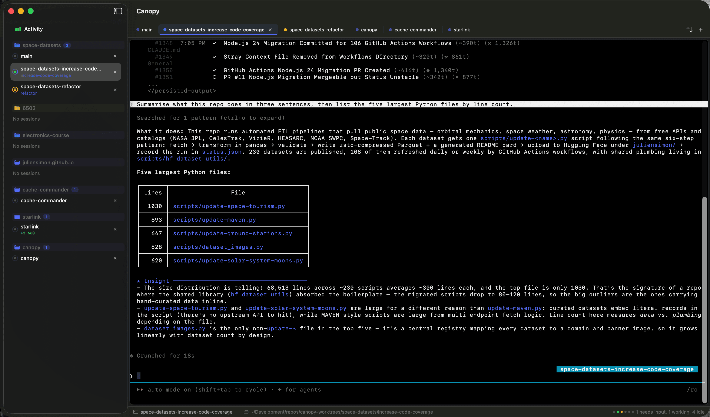
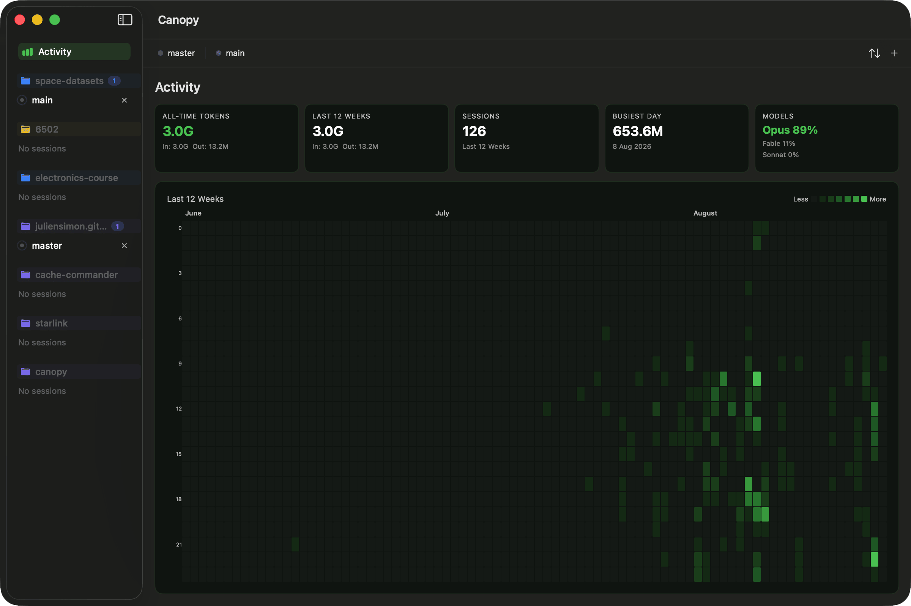
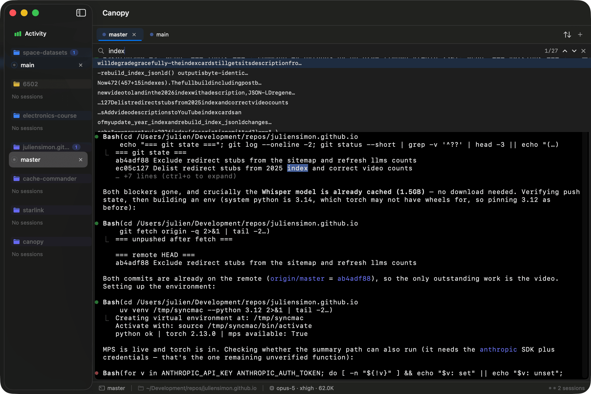
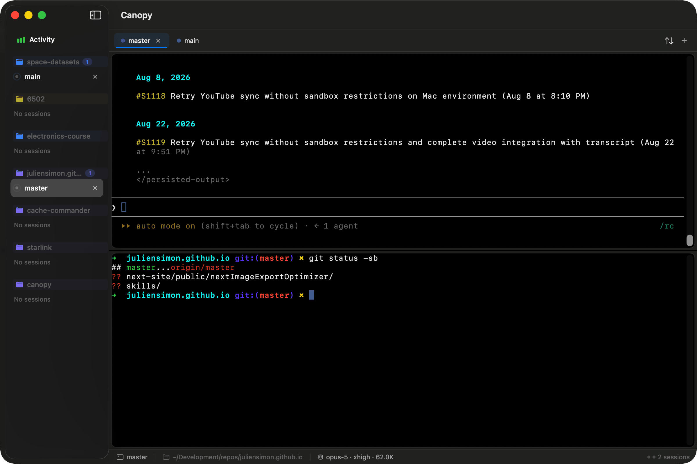
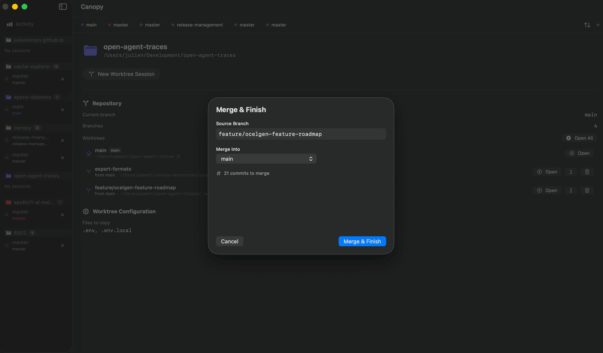
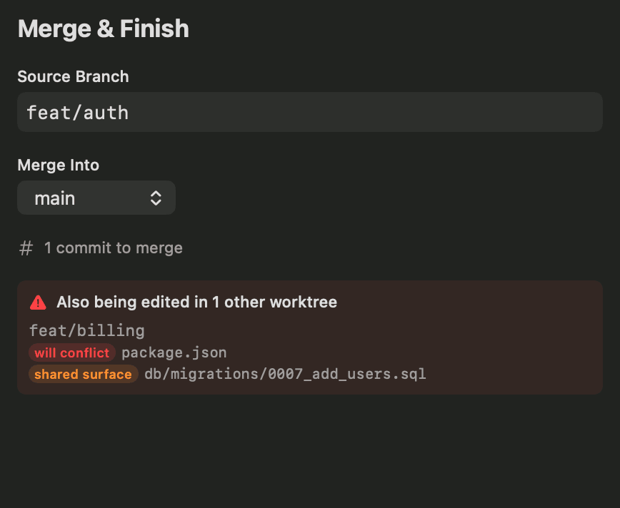
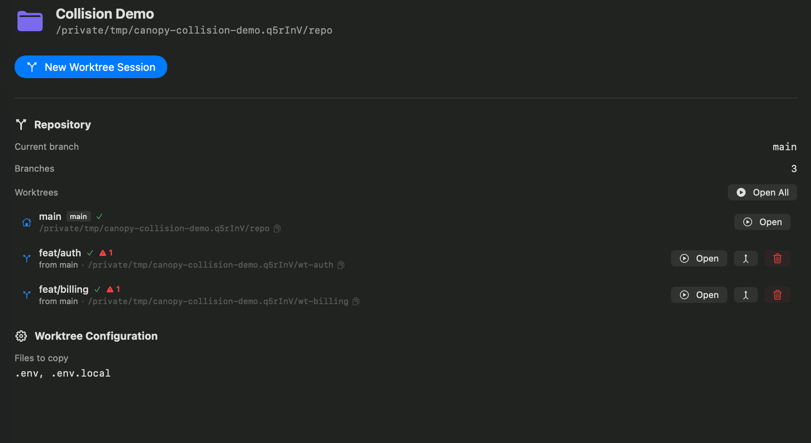
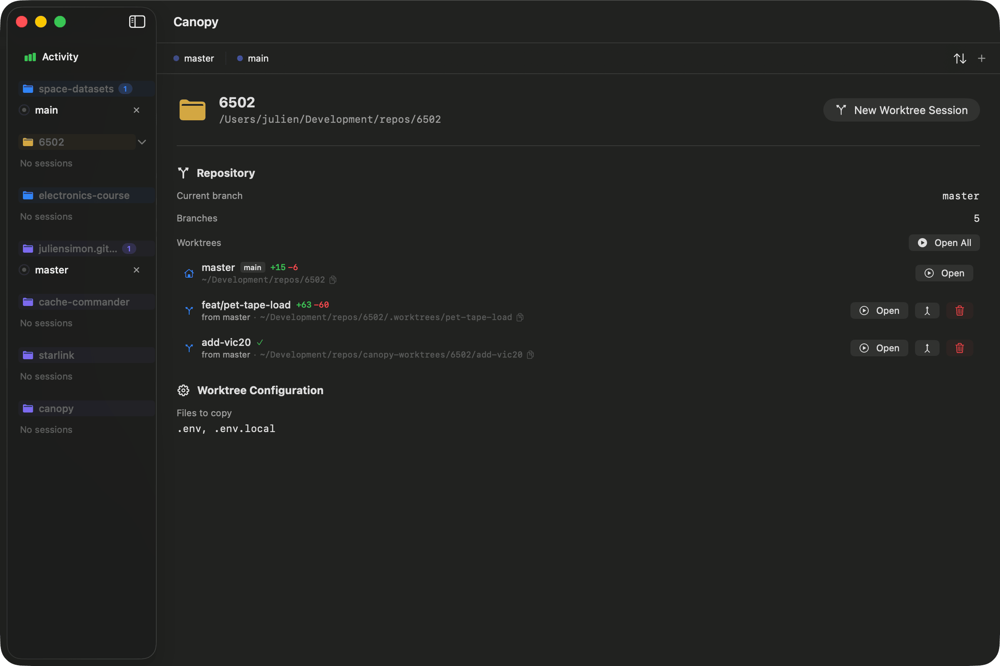

<div align="center">


**The cockpit for parallel Claude Code sessions — a native macOS app.**

*Claude Code can make the worktrees. Canopy shows you which ones are about to collide, and merges them back.*

<br/>

[](https://github.com/juliensimon/canopy/releases/latest)
[](https://github.com/juliensimon/canopy/releases)
[](https://github.com/juliensimon/canopy/actions/workflows/ci.yml)
[](https://codecov.io/gh/juliensimon/canopy)
[](https://github.com/juliensimon/canopy/stargazers)
[](https://github.com/juliensimon/canopy/issues)
[](https://github.com/juliensimon/canopy/commits/master)

[](https://www.apple.com/macos/)
[](https://swift.org)
[](LICENSE)

<br/>

### [⬇ Download Canopy for macOS](https://github.com/juliensimon/canopy/releases/latest/download/Canopy.dmg)

<sub>Free and open source · Universal binary · Apple Silicon + Intel · Notarized · macOS 14+</sub>

<br/>

<a href="https://www.producthunt.com/products/canopy-5?embed=true&amp;utm_source=badge-featured&amp;utm_medium=badge&amp;utm_campaign=badge-canopy-1456" target="_blank" rel="noopener noreferrer"></a>

</div>

---

<div align="center">

https://github.com/user-attachments/assets/e455e1a9-884c-46e5-bd14-9c0fc3424672

</div>

---

| You used to do this | With Canopy |
|---|---|
| Hunt through `~/.claude/projects/<hash>/` for a session ID, then `claude --resume abc123…` | Click the tab. Canopy resumes the right session automatically. |
| Juggle six Terminal.app windows, cmd-tabbing to find the right one | One window, one tab bar, `Cmd+1`–`Cmd+9` to jump anywhere |
| `git checkout main && git pull && git merge feat/… && git worktree remove … && git branch -d …` | Right-click → **Merge & Finish** — two panels, one button |

*[Nine more of these below.](#what-you-actually-get-back)*

---

## Why I built this

I've been using Canopy every day for months on my own projects. I'm sharing it now because it has earned its place on my dock, and I think it might earn a place on yours too.

Here's the honest pitch: **Claude Code is a superpower. Canopy feels like wearing all five Infinity Stones.**

When you use Claude Code seriously — not just for experiments, but for real production work — you hit a wall the tool wasn't designed to push through. Claude is brilliant at focusing on *one* thing in *one* directory. But real engineering work doesn't come one thing at a time. A bug report lands while you're refactoring. A teammate asks you to review a change while you're writing tests. The roadmap demands you keep shipping while you investigate a flaky test. You need to work on three things at once, but Claude — and `git` — want you to work on one.

You *can* hack around it: stash, checkout, maybe a second clone, maybe `git worktree add` and a hand-written shell script to copy your `.env`, maybe remember which of your six Terminal.app tabs was running which session. You end up with a tab graveyard, stale worktrees littering your disk, Claude sessions you can't find, and a quiet tax on every task you do.

Canopy removes that tax. Completely.

**And to be straight with you about what changed:** Claude Code now creates worktrees on its own — `claude -w`, `/fork`, subagents that isolate themselves. That part is solved, it's free, and it's cross-platform. So making a worktree is no longer the interesting problem.

Running *eight* of them is. Nothing upstream tells you that two of your branches are both editing the lockfile, or both adding a migration with the same sequence number — a conflict `git merge-tree` structurally cannot see until you're already merging. Nothing upstream integrates a finished branch back for you. And Claude Code now creates **more** unwatched worktrees, not fewer, with a cleanup sweep that deliberately skips anything containing work — so they pile up, with real commits in them, and nobody is looking.

That's what Canopy is for: the pre-flight before the merge, the merge itself, and one window that shows you which of your agents is stuck waiting on you right now.

## What you actually get back

Every Canopy feature exists because I was tired of doing something manually. Each one saves a few seconds. Do the math over a day — over a week, over a month — and the compound is real.

| You used to do this | With Canopy |
|---|---|
| Stash your work, checkout another branch, lose Claude's conversation context | Open a new worktree session — your old session keeps running in another tab |
| Hunt through `~/.claude/projects/<hash>/` for a session ID, then `claude --resume abc123…` | Click the tab. Canopy resumes the right session automatically. |
| Juggle six Terminal.app windows, cmd-tabbing to find the right one | One window, one tab bar, `Cmd+1`–`Cmd+9` to jump anywhere |
| Copy-paste the working directory into Cursor/VS Code with cmd-c / cmd-shift-o / cmd-v | Right-click → **Open in IDE** |
| Switch windows to run `git log` while Claude is working | `Cmd+Shift+D` — shell pane drops in below Claude, no interruption |
| Re-run `npm install`, copy `.env`, symlink `node_modules` every time you make a worktree | Configure once per project. Canopy does it on every new worktree. |
| Wonder which of your branches are merged and safe to delete | Project view lists every worktree with status and a one-click **Merge & Finish** |
| `git checkout main && git pull && git merge feat/… && git worktree remove … && git branch -d …` | Right-click → **Merge & Finish** — two panels, one button |
| Squint at `ls ~/.claude/projects/` trying to guess how many tokens you've burned this week | Open **Activity** — token counts, session history, 12-week heatmap |
| Type out the same "write tests", "review security", "update docs" prompt for the tenth time | Save it once in the **Prompt Library** — one right-click to fire it at any session |
| Scroll a flickering terminal trying to re-read what Claude said ten minutes ago | Right-click → **Show Transcript** — the conversation as clean markdown, live-updating |
| Worry about what an autonomous agent might touch outside the repo | Pick a **sandbox** — per session, per project, or globally. Three of them, from Claude Code's own Bash sandbox to a full VM with only your worktree and its repo mounted |

None of these are big problems on their own. All of them are papercuts. Canopy is a tool for people who notice papercuts.

---

## Install

### Homebrew (recommended)

```bash
brew install --cask juliensimon/canopy/canopy
```

### Direct download

Grab the latest `.dmg` from **[Releases](https://github.com/juliensimon/canopy/releases/latest)**. Open, drag to Applications, launch.

Canopy is signed and notarized, so it opens normally — no Gatekeeper warning, no right-click-Open dance.

### Requirements

| | |
|---|---|
| **Required** | macOS 14 Sonoma or later · Apple Silicon or Intel · Claude Code on your `$PATH` |
| **Optional** | `gh` for pull-request data (`brew install gh`) · Docker Desktop + `sbx`, or Apple `container`, for the VM sandboxes |

Using it at work? Canopy is AGPL-3.0, and commercial licenses are available — see **[License](#license)**.

---

## Quick start

**Fastest path:** press `Cmd+T`, point at any git repository, and start prompting. No project to add, nothing to configure — that is already Canopy working, and it is worth doing before anything else.

The five steps below are for the part that needs a little setup: several worktrees running at once.

1. **Add a project** (`Cmd+Shift+P`) — point at any git repository. Configure files to copy (`.env`), symlink paths (`node_modules`), and setup commands (`npm install`).
2. **Create a worktree session** (`Cmd+Shift+T`) — pick a base branch, name your feature branch.
3. Canopy creates the worktree, copies config, runs your setup, and launches Claude Code. Start prompting.
4. Need a parallel task? `Cmd+Shift+T` again. Each session is completely isolated.
5. When you're done with a session, right-click → **Merge & Finish**. Canopy merges your branch and cleans up the worktree.

That's the whole loop. Repeat forever.

---

## Features in depth

### 🪟 Parallel sessions, one window



Each tab is a separate worktree running its own Claude Code instance. Switch between them with `Cmd+1`–`Cmd+9`. Drag tabs to reorder. Sort by name, project, creation date, or directory with `Cmd+Shift+S`. Activity dots show which sessions are working, and — the one you actually want — which are **blocked waiting on you**. A permission prompt turns the dot amber and the status bar reads "1 needs input", so a stalled agent no longer looks identical to an idle one. (Canopy asks Claude Code directly for this, so it needs a backend that runs Claude on the host: *Off* or *Claude sandbox*.)

The status bar names the active session's Claude run: `opus-5 · xhigh · 402.3K` — the model that produced its last turn, the reasoning effort, and how much context that turn had to read. With six worktrees open, that is how you tell which session is on which model and which one is close to compacting. The count is absolute rather than a share of the window, because a 200k and a 1M session are indistinguishable in the transcript and a percentage would be confidently wrong for one of them.

When you close and reopen Canopy, every session comes back — **with its Claude conversation resumed automatically**. No session IDs to remember, no `--resume` flags to type.

Canopy *assigns* the ID rather than guessing it: a new session is launched with `--session-id <uuid>`, and every launch after that resumes that exact conversation. So a tab is bound to its own conversation from the start — running `claude` yourself in the same directory can't hijack it, and the transcript and token counts work immediately instead of only after the first restart.

---

### 📊 Activity dashboard — know where your tokens go



Token usage is the one thing Claude Code doesn't surface well. Canopy fixes that.

The **Activity** view parses your `~/.claude/projects/` JSONL files and gives you a full picture of how you've been using Claude:

- **All-time token totals** — input and output, across every session you've ever run
- **Last 12 weeks** — same breakdown, so you can see recent trends
- **Session count** — how many conversations you've had in the window
- **Busiest day** — when were you deep in Claude?
- **Model breakdown** — percentage split by model family (Opus, Fable, Sonnet, Haiku), derived from the model ID so a newly released family shows up as itself rather than in a catch-all
- **Hour-by-hour heatmap** — 12 weeks of your actual working hours, visualized

This is the view I use to answer "am I on track for my API budget this month" and "when am I most productive." No third-party tools, no scraping, no estimation — it's reading the same JSONL files Claude Code writes.

---

### ⌨️ Command palette — fuzzy search everything

`Cmd+K` opens a fuzzy-match palette over your sessions (searchable by name, project, branch, and terminal output), your projects, and quick actions (New Session, New Worktree Session, Settings). Type three letters of a branch name, hit return, you're there. Type the name of a project, hit return, the project view opens.

If you have more than four or five sessions open, this is the fastest way to navigate. Faster than clicking. Faster than Mission Control. Fast enough to feel instant.

---

### 🔎 Find in terminal — stop scrolling



`Cmd+F` inside any session opens an incremental search over the terminal output. Matches highlight as you type. Return jumps to the next match. Shift-return jumps to the previous one. Escape closes the search.

This is a small feature that turns out to matter a lot: when Claude produces a 400-line plan and you need to jump to the part about "database migration," you used to scroll. Now you don't.

---

### 📜 Show Transcript — read the conversation, not the terminal

Right-click any session → **Show Transcript…** for a clean, scrollable, read-only view of the whole conversation. When Claude Code is running, Canopy reads its structured JSONL session log and renders user/assistant turns with markdown formatting — tool calls compacted to one-line summaries instead of walls of raw output. It live-updates as Claude streams, with an auto-tail toggle so you can read history without being yanked back down. The Copy button (`Cmd+Shift+C`) puts the formatted markdown on your clipboard — handy for PR descriptions and notes.

---

### ⬓ Split terminal — Claude up top, shell below



`Cmd+Shift+D` toggles a secondary shell pane below Claude's terminal. Need to run `git status` while Claude is mid-thought? Peek at the test output from another tool? Tail a log? You don't need to interrupt Claude or open a new window. The split pane is a full interactive shell, scoped to the same worktree, and you can hide it the same way you showed it.

This is the feature I was most skeptical I'd use, and now I can't imagine working without it.

---

### 🛡 Sandboxes — run Claude in isolation

Pick a sandbox backend in Settings — globally, per project, or per session in the New Worktree Session sheet. Four choices — **Off** plus three sandboxes — and the three protect genuinely different amounts, so the picker says so under each one.

The two VM backends bind-mount your worktree (and, for a worktree session, its main repo — git needs it) so file edits work normally, while everything not mounted is out of reach: SSH keys, documents, the Keychain, other repos, the rest of your home directory. A shield icon marks sandboxed sessions in the sidebar, and the split terminal still opens a host shell for inspecting the real filesystem. Canopy validates the required tools before enabling a backend — and again when a session launches, so a backend that stopped being ready (e.g. the container runtime wasn't restarted after a reboot) shows the fix in the terminal instead of a cryptic error. The [user guide](docs/guide.md#what-sandboxing-does--and-doesnt--protect-against) spells out exactly what is and isn't protected (the mounted project and outbound network are deliberate trade-offs).

**Claude sandbox (Bash only)** — Claude Code's own sandbox, built on macOS Seatbelt. It wraps each shell command in `sandbox-exec`, so the profile covers only what Claude shells out to — Read/Edit/Write are in-process and go through the permission system instead. Nothing to install, no image, no daemon, and session resume works. It is also the weakest of the three: it confines **Bash only** (Read/Edit/Write go through the permission system instead), and **reads are governed by a deny-list rather than an allowlist**, so `~/.ssh` and `~/.aws/credentials` remain readable. Canopy sets `allowUnsandboxedCommands: false` so the agent cannot ask its way out of the sandbox — without that, a denied command is simply retried unsandboxed and auto-approved.
*Requirements:* none.

**Docker Sandbox (sbx)** — a [Docker Sandbox](https://docs.docker.com/ai/sandboxes/) microVM via `sbx run`. **Legacy:** session resume does not work, because transcripts live inside the ephemeral microVM. Worktree sessions get the main repo mounted as an extra workspace so git works.
*Requirements:* [Docker Desktop](https://www.docker.com/products/docker-desktop/) and `sbx` (`brew install docker/tap/sbx`).

**Apple container** — a lightweight VM via Apple's open-source [container](https://github.com/apple/container) runtime, no Docker Desktop needed. **The strongest option**, and the only one that confines the whole Claude process rather than just the commands it shells out to. Canopy mounts the worktree, the project's main repo, and your `~/.claude` state at their host paths — so git works inside the sandbox and **session resume works**, unlike sbx. The default `canopy-claude` image is built in one click (**Settings → Build Image**); a one-time `/login` inside the first sandboxed session sets up credentials. Claude Code is baked into the image, so click **Update** when you want to pull a newer version into it.
*Requirements:* macOS 26+ on Apple silicon, `brew install container`, `container system start` once per boot. Full setup steps in the [user guide](docs/guide.md#sandbox-modes).

---

### ✅ Merge & Finish — one click, one worktree retired



The last step of every feature used to be a four-command dance:

```bash
git checkout main
git pull
git merge feat/whatever
git worktree remove ../canopy-worktrees/myproject/feat-whatever
git branch -d feat/whatever
```

…except you never actually did all of it, and now you have 11 stale worktrees and 40 merged branches on your laptop. Canopy replaces the whole thing with a two-phase confirmation sheet. Phase 1: pick the target branch, confirm the commit count, see any conflicts before they happen. Phase 2: pick what to clean up — worktree directory, feature branch, both, or neither. One click. Done. No debt.

**Cross-worktree pre-flight.** With several worktrees in flight, Phase 1 also shows how the branch you're merging collides with your *other* worktree branches — before you merge. It flags two kinds: **will conflict** (a real textual conflict, computed with `git merge-tree` without touching your working tree) and **shared surface** (both branches touch a high-stakes file — a package manifest, lockfile, migration, or generated type — that may merge cleanly but still break, like two `0007_*.sql` migrations with different names). It's advisory: it never blocks the merge, it just shows where parallel work overlaps. The same collisions appear as a ⚠ badge on each worktree row in the project view.





---

### 🌳 Project view — see every worktree at once



Click any project in the sidebar to see every worktree, its branch, its status, a ⚠ badge when it collides with another worktree, and a one-click button to open, merge, or delete it. "Open All" resumes every inactive worktree at once with their prior Claude sessions — the fastest way to get back into a multi-branch project after a weekend away.

The project view also lists every open pull request for the repository, pulled via `gh pr list` — so you can see at a glance which of your worktrees already have a PR in flight and which are still local.

---

### 🔀 Git awareness — always-visible repo state

Canopy polls `git` and `gh` every 10 seconds so you never have to drop into a shell to check the state of the current worktree. You see:

- **Status bar** at the bottom of the window, for the active session: modified files with `+` / `−` line counts, commits ahead of the upstream, and open pull request count (with draft split). Hover any pill for a full tooltip — file list, push status, PR titles. The same bar carries the session's model, effort and live context size — see *Parallel sessions* above.
- **Sidebar session rows** show a compact `+N / −N` diffstat and an up-arrow count for commits-ahead, so you can scan all your worktrees at once.
- **Project detail view** lists every open PR with title, number, author, and draft status.

Requires `gh` to be installed for the PR data (`brew install gh`). Path is auto-detected; override in Settings if needed.

---

### 📋 Prompt Library — reusable prompts, one right-click away

Build a library of prompts you use repeatedly — "write tests for this", "check for security issues", "update the README" — and fire them at any session without retyping.

**Sending a prompt:** Right-click any session → **Send Prompt**. Starred prompts appear inline in the submenu for instant access. Click **Browse All…** to search the full library.

**Managing the library:** Open **Settings → Prompt Library**. Add, edit, reorder (drag-and-drop), star, and delete prompts. All changes save immediately.

**Template variables** are substituted at send time:

| Variable | Resolves to |
|---|---|
| `{{branch}}` | Current git branch of the session |
| `{{project}}` | Project name |
| `{{dir}}` | Working directory name (last path component) |

A prompt like `"Review {{branch}} for correctness and add tests"` becomes `"Review feat/auth for correctness and add tests"` when sent to that session.

---

## Keyboard shortcuts

| Shortcut | Action |
|---|---|
| `Cmd+T` | New session (directory picker) |
| `Cmd+Shift+T` | New worktree session |
| `Cmd+Shift+P` | Add project |
| `Cmd+K` | Command palette |
| `Cmd+F` | Find in terminal |
| `Cmd+Shift+D` | Toggle split terminal |
| `Cmd+Shift+A` | Activity dashboard |
| `Cmd+Shift+S` | Cycle tab sort mode |
| `Cmd+1`–`Cmd+9` | Jump to tab N |
| `Cmd+Shift+C` | Copy transcript (in Show Transcript view) |
| `Cmd+,` | Settings |
| `Cmd+?` | Help |

---

## How it works

Canopy builds on two ideas that play well together:

- **[Git worktrees](https://git-scm.com/docs/git-worktree)** let you check out multiple branches of the same repo simultaneously, each in its own directory, sharing one `.git` store. Creating one is cheap and fast.
- **Claude Code sessions** are directory-scoped and resumable. Canopy assigns each tab its own session ID at launch (`--session-id`) and resumes that exact conversation afterwards (`--resume`), so conversations survive restarts and a tab can't be hijacked by an unrelated `claude` run in the same directory.

Everything else — the tabs, the project view, the Activity dashboard, the palette, the split pane — is a native SwiftUI app wrapped around [SwiftTerm](https://github.com/migueldeicaza/SwiftTerm) for terminal emulation. No Electron, no webviews, no bundled Node. It launches fast, idles quiet, and behaves like a Mac app.

For a deeper walkthrough, read the **[User Guide](docs/guide.md)**.

---

## Per-project configuration

Every project can be configured independently from the **Add Project** sheet:

| Setting | Example | Why |
|---|---|---|
| Files to copy | `.env`, `.env.local` | Untracked config files Claude needs at runtime |
| Symlink paths | `node_modules`, `.venv`, `vendor` | Heavy directories; symlinks save disk and install time |
| Setup commands | `npm install`, `bundle install`, `make setup` | Run once in each fresh worktree |
| Worktree base directory | `~/worktrees/myproject` | Where new worktrees live (default: `../canopy-worktrees/<project>`) |
| Auto-start Claude | on/off | Per-project override of the global default |
| Claude flags | `--permission-mode auto` | Per-project override of the global flags. Individual sessions can override again in the New Worktree sheet |
| Sandbox backend | Off / Claude sandbox / Docker Sandbox / Apple container | Claude Code's own Bash sandbox, a [Docker Sandbox](https://docs.docker.com/ai/sandboxes/) microVM, or an [Apple container](https://github.com/apple/container) VM |
| Sandbox flags | `--memory 8g` | Additional flags passed to `sbx run` |
| Container image / flags | `canopy-claude` / `--memory 8g` | Image and extra flags for the Apple container backend |

All configuration lives in `~/.config/canopy/`:

- `settings.json` — global preferences
- `projects.json` — project list and per-project config
- `projects.backup.json` — automatic backup created on every launch
- `sessions.json` — persisted sessions, restored on app restart
- `sessions.backup.json` — automatic backup created on every launch
- `prompts.json` — saved prompt library
- `prompts.backup.json` — automatic backup created on every launch

---

## Contributing

Found a bug, have a feature request, or want to send a patch? **[Open an issue](https://github.com/juliensimon/canopy/issues)** or a PR.

Because Canopy is dual-licensed (see below), contributors are asked to sign the **[Contributor License Agreement](CLA.md)** by submitting a pull request. This is a lightweight CLA that grants the project maintainer the right to relicense contributions. It's what makes dual licensing possible while keeping the open source version free under AGPL.

---

## Author

Built by **Julien Simon** — [julien@julien.org](mailto:julien@julien.org).

I've been writing software for a long time. I built Canopy because I use Claude Code every day and the rough edges were getting in the way of the work. It started as a weekend experiment and turned into the tool I now reach for first every morning.

If Canopy saves you time, the best thank-you is to tell someone else who might also find it useful — post it on social, drop it in a Slack, submit a PR. A star on the repo never hurts either.

---

## License

Copyright © 2026 Julien Simon.

Canopy is licensed under the **[GNU Affero General Public License v3.0](LICENSE)** (AGPL-3.0). You can use it, modify it, and redistribute it under the terms of that license.

**Commercial licensing**: If you need to use Canopy under terms other than AGPL-3.0 — for example, embedding it in a proprietary product or redistributing without source disclosure — commercial licenses are available. Contact [julien@julien.org](mailto:julien@julien.org).
